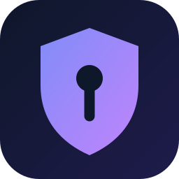

<div align="center">
  

  # dsh-enterprise-gateway

  **DSH 企业网关 · DSH Enterprise Gateway**

  统一大模型入口 · 密钥托管 · 治理与容灾
  One LLM entrypoint · Key custody · Governance & failover

  <sub>独立开源项目，非 DeepSeek 官方产品 · Independent open-source project, not an official DeepSeek product</sub>

  <p>
    <a href="https://github.com/mafeis/dsh-enterprise-gateway/releases/latest"></a>
    <a href="https://www.npmjs.com/package/dsh-enterprise-gateway"></a>
    <a href="https://www.npmjs.com/package/dsh-enterprise-gateway"></a>
    <a href="LICENSE"></a>
  </p>
  <p>
    =22.5">
    
    
  </p>

  [简体中文](#-简体中文) · [English](#-english) · [最新下载](https://github.com/mafeis/dsh-enterprise-gateway/releases/latest)
</div>

<!-- 截图位：把管理台截图放到 assets/screenshot-admin.png 后取消下面注释
<p align="center">
  
</p>
-->

---

## 🇨🇳 简体中文

### 它解决了什么问题

企业里用户各自直连大模型，麻烦一大串：

- **密钥散落** — OpenAI / Anthropic / Gemini 的 API Key 复制到每台电脑，谁拷走了都不知道
- **无法管控** — 谁在用、用多少、花了多少钱，管理员一概不知
- **不安全** — 内部敏感内容原样发给外部模型，没有检测和留痕
- **不可靠** — 某家供应商挂了，用户工作直接中断

DSH 企业网关把所有大模型访问收敛到一个入口：用户终端只连网关，真实密钥只存在服务器；管理员在一个管理台完成模型上架、用户与计费、安全防护、审计留痕、客户端管控。供应商故障自动切换备用家，恢复后自动回切，用户无感。

### 快速上手

```powershell
# 1. 全局安装（一条命令）
npm i -g dsh-enterprise-gateway

# 2. 任意目录启动（首次自动生成 ./data 与引导管理员）
dsh-enterprise-gateway

# 3. 打开管理台 http://127.0.0.1:8899/admin
#    初始密码只在首次启动日志打印一次（找「初始密码: xxxx」），登录后请立即改密

# 4. 管理台配置上游供应商与密钥 → 用户端装 dsh-enterprise 插件，登录即用
```

不想全局装？`npx dsh-enterprise-gateway` 直接跑；数据目录可用 `ENT_DATA_DIR` / `ENT_DB_PATH` 指定。

> **安全提示**：网关默认只监听 `127.0.0.1`。部署给用户使用时，请放到反向代理（HTTPS）之后，不要把管理台直接暴露在公网。

### 功能一览

| 功能 | 说明 |
| --- | --- |
| 多供应商接入 | OpenAI / Anthropic / Gemini 协议，密钥服务端托管，管理台可改即热生效 |
| 模型目录 | 上架/下架、思考档位、输入模式（图片/视频）、定价 |
| 容灾切换 | 模型级备用供应商，主家失败自动切换、恢复自动回切 |
| 健康探测 | 供应商独立探测，连续失败自动停用、通过自动恢复 |
| 管理台 | 供应商、用户、计费账单、安全防护、审计、客户端管控，一个页面全搞定 |
| 安全 | JWT 鉴权 + 登录防爆破、DLP 内容检测、全量请求留痕、设备令牌 |

### 环境要求

| 依赖 | 版本 / 说明 |
| --- | --- |
| Node.js | `>=22.5`（推荐 22 LTS 或 24） |
| 运行时依赖 | 仅 1 个：`@deepseek-ai/cordis`（插件化内核），`npm install` 一键装好 |
| 数据库 | 内置 SQLite，无需单独安装数据库服务 |
| 操作系统 | Windows / Linux / macOS 均可 |

### 常用命令

```powershell
node scripts/check-business.mjs    # 业务体检：心跳 / 最近请求 / 今日统计
node scripts/smoke.mjs             # 冒烟测试
node scripts/reset-admin-pw.mjs <新密码>   # 重置管理员密码
```

### 从源码运行（开发者）

<details>
<summary>展开</summary>

```powershell
git clone https://github.com/mafeis/dsh-enterprise-gateway.git
cd dsh-enterprise-gateway/gateway
npm install

# 准备配置（首次）：copy gateway-config.example.json data\gateway-config.json
# 供应商密钥写入 data\.env，一行一个：ENT_PROV_<名字>_KEY=sk-xxx

node gateway.mjs
```

</details>

### 文档

| 文档 | 内容 |
| --- | --- |
| [网关核心文档](gateway/docs/网关核心文档.md) | 架构、插件契约、配置路径链、API 清单、运维排错 |
| [管理台页面文档](gateway/docs/admin-plugin-pages.zh.md) | 各插件管理页说明 |
| [插件映射](gateway/docs/plugin-map.zh.md) | 网关服务与插件的对应关系 |

## 🇬🇧 English

### What problem does it solve

When users connect to LLM providers directly, trouble follows:

- **Keys scattered everywhere** — OpenAI / Anthropic / Gemini API keys copied onto every machine, with no idea who took one
- **Zero visibility** — who is using what, how much, and at what cost: admins have no clue
- **No safety net** — internal sensitive content sent verbatim to external models, unchecked and unlogged
- **Fragile** — one provider outage and everyone's work stops

DSH Enterprise Gateway funnels all LLM traffic through a single entrypoint: user terminals only talk to the gateway, and real API keys live on the server only. Admins handle model catalogs, users & billing, content security, audit trails and client governance from one admin console. Provider outages fail over to backup providers automatically and switch back on recovery — users never notice.

### Quick start

```powershell
# 1. Install globally (one command)
npm i -g dsh-enterprise-gateway

# 2. Start from any directory (./data and the bootstrap admin are created on first run)
dsh-enterprise-gateway

# 3. Open http://127.0.0.1:8899/admin
#    The initial password is printed once in the startup log
#    (look for「初始密码: xxxx」) — change it right after signing in

# 4. Configure upstream providers and keys in the admin console
#    → install the dsh-enterprise plugin on user terminals, sign in and go
```

Prefer not to install globally? Run `npx dsh-enterprise-gateway`; the data directory can be relocated via `ENT_DATA_DIR` / `ENT_DB_PATH`.

> **Security note**: the gateway listens on `127.0.0.1` only by default. When deploying for users, put it behind a reverse proxy (HTTPS) — never expose the admin console directly to the public internet.

### Features

| Feature | Description |
| --- | --- |
| Multi-provider | OpenAI / Anthropic / Gemini protocols; keys kept server-side, hot-reloaded from the admin console |
| Model catalog | Publish / unpublish, thinking tiers, input modes (image/video), pricing |
| Failover | Per-model backup providers; automatic failover and automatic switch-back |
| Health probing | Independent provider probes; auto-disable after repeated failures, auto-recover |
| Admin console | Providers, users, billing, content security, audit, client governance — all in one place |
| Security | JWT auth + brute-force protection, DLP inspection, full request audit trail, device tokens |

### Requirements

| Dependency | Version / Notes |
| --- | --- |
| Node.js | `>=22.5` (22 LTS or 24 recommended) |
| Runtime dependencies | Just one: `@deepseek-ai/cordis` (plugin kernel) — installed by `npm install` |
| Database | Built-in SQLite — no separate database server needed |
| OS | Windows / Linux / macOS |

### Common commands

```powershell
node scripts/check-business.mjs    # Health check: heartbeat / recent requests / daily stats
node scripts/smoke.mjs             # Smoke test
node scripts/reset-admin-pw.mjs <new-password>   # Reset the admin password
```

### Run from source (developers)

<details>
<summary>Expand</summary>

```powershell
git clone https://github.com/mafeis/dsh-enterprise-gateway.git
cd dsh-enterprise-gateway/gateway
npm install

# Prepare config (first run): copy gateway-config.example.json data\gateway-config.json
# Write provider keys into data\.env, one per line: ENT_PROV_<NAME>_KEY=sk-xxx

node gateway.mjs
```

</details>

### Documentation

| Document | Contents |
| --- | --- |
| [Gateway core docs](gateway/docs/网关核心文档.md) | Architecture, plugin contract, config path chain, API list, ops & troubleshooting |
| [Admin pages docs](gateway/docs/admin-plugin-pages.zh.md) | Per-plugin admin page reference (Chinese) |
| [Plugin map](gateway/docs/plugin-map.zh.md) | Gateway services ↔ plugins mapping |

---

## 🔗 Related / 相关项目

- [dsh-enterprise](https://github.com/mafeis/dsh-enterprise) — DSH 客户端插件，用户终端装它即可登录即用 · DSH client plugin for user terminals (pairs with this gateway · 与网关配对使用)

## 🤝 友情链接 / Friend Links

收录 DSH 生态相关项目。

| 项目 | 简介 | 链接 |
| --- | --- | --- |
| DSH Desktop | 基于 DeepSeek Harness 构建的开源桌面客户端，配套插件在其上运行。 | [GitHub](https://github.com/anywhere-labs/dsh-desktop) · [官网](https://dshdesktop.cn) |
| DeepSeek Harness | DSH 官方上游：核心智能体、插件系统与 Web UI。 | [GitHub](https://github.com/deepseek-ai/deepseek-harness) · [DeepSeek 官网](https://www.deepseek.com) |

## 🙏 致谢 / Acknowledgements

- 网关的插件化内核基于 [@deepseek-ai/cordis](https://www.npmjs.com/package/@deepseek-ai/cordis)（[Cordis](https://github.com/cordiverse/cordis) 插件框架思想）构建
- 借助 [DeepSeek Harness](https://github.com/deepseek-ai/deepseek-harness) 的插件体系与生态落地
- 配套插件基于 [DSH Desktop](https://github.com/anywhere-labs/dsh-desktop) 开发

The plugin kernel is built on `@deepseek-ai/cordis` (Cordis), and the project ships within the DeepSeek Harness plugin ecosystem. The companion plugin is developed for [DSH Desktop](https://github.com/anywhere-labs/dsh-desktop). Thanks to these open-source projects.

## 📄 License

[MIT](LICENSE)
